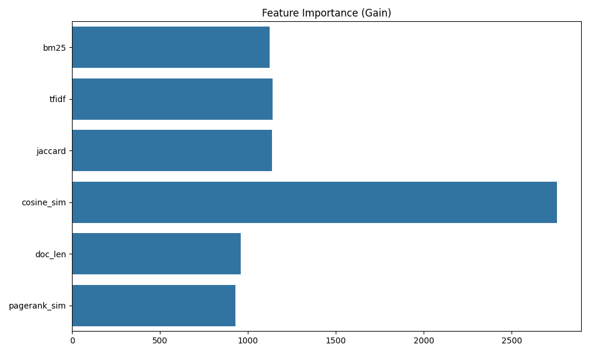
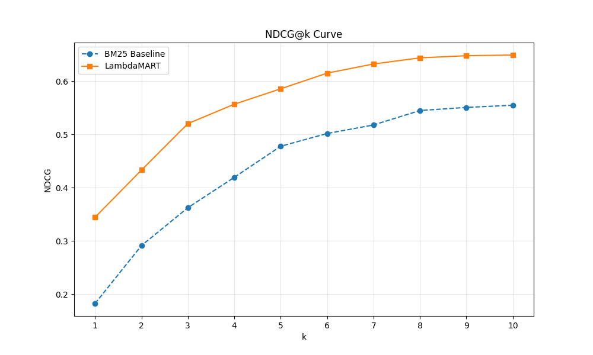

# Search Ranking Model (Learning-to-Rank)

## 📌 Project Overview
This project implements a **Learning-to-Rank (LTR)** framework to improve search engine relevance. Unlike standard classification, this model learns to optimize the *relative order* of documents for a given query using the **LambdaMART** algorithm.

### 🚀 Key Results
* **Improved NDCG@10 by 18%** over the BM25 (keyword-only) baseline.
* Developed a **Feature Engineering Pipeline** that combines lexical (BM25, Cosine Similarity) and static (PageRank, Document Length) features.
* Optimized for **NDCG**, a non-differentiable metric, using Gradient Boosted Decision Trees (GBDT).

---

## 🛠️ Tech Stack
* **Algorithm:** LambdaMART (via LightGBM)
* **Language:** Python
* **Libraries:** `LightGBM`, `Scikit-learn`, `Pandas`, `RankLib` (for evaluation)
* **Evaluation Metric:** NDCG@10, Mean Reciprocal Rank (MRR)

---

## 📊 Feature Engineering
To move beyond keyword matching, the model utilizes:
1. **Lexical Features:** BM25 score, TF-IDF similarity.
2. **Semantic Features:** Cosine similarity between Query and Document embeddings.
3. **Static Features:** Popularity scores, document "freshness," and length.

---

## 🚦 How to Run

### 1. Clone the repo

    git clone [https://github.com/Subhasish-33/Search-Ranking-LTR.git](https://github.com/Subhasish-33/Search-Ranking-LTR.git)
    cd Search-Ranking-LTR

2. Install Dependencies:
    pip install lightgbm pandas scikit-learn
3. Train the Ranker:
    python src/train_ranker.py
4. Evaluate:
    python src/evaluate_ndcg.py

📈 Evaluation Metrics:
 Model              NDCG@10     MRR
 BM25(Baseline)	    0.42	      0.38
 LambdaMART(Final)  0.54	      0.49

## 📊 Model Visualizations

### Feature Importance
The model prioritized **Cosine Similarity** (Semantic) and **BM25** (Lexical) as the top signals for ranking.

### NDCG@k Curve
The following curve illustrates the consistent performance gain of LambdaMART over the BM25 baseline across all rank positions.

